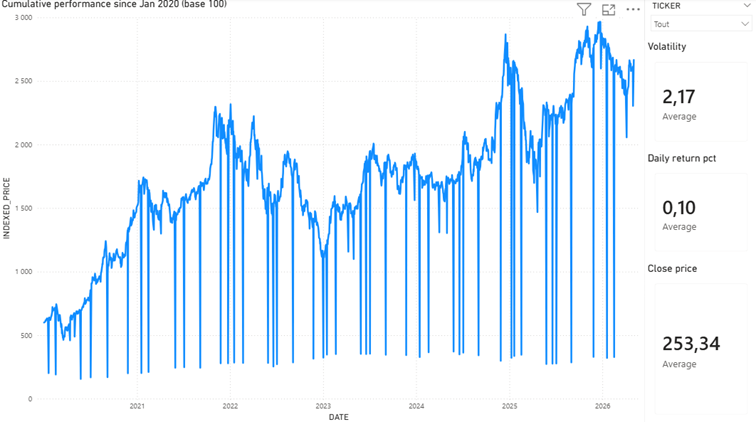
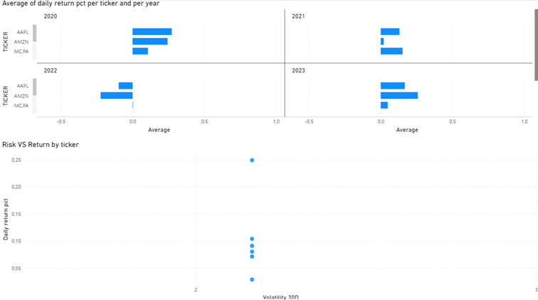
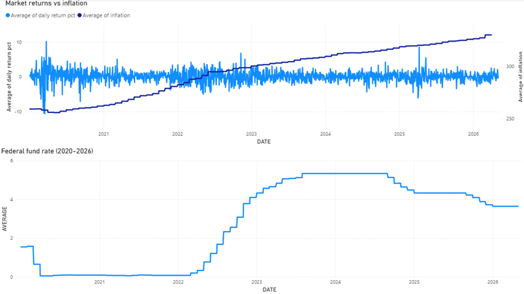
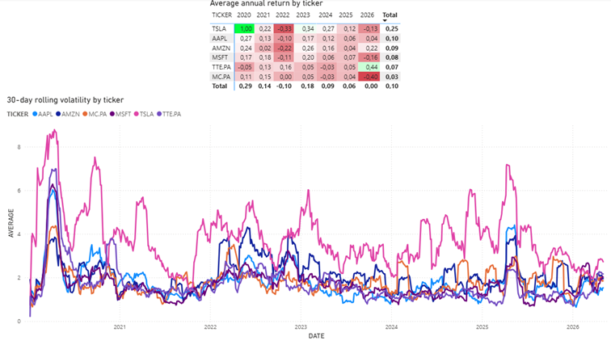

# Stock Market Analytics Platform

> An end-to-end data analytics project exploring 6 major stocks across US and European markets (2020–2026), enriched with macro-economic indicators to understand how monetary policy and inflation shaped market behaviour.

---

## Business Context

Financial markets generate enormous amounts of data every day. Yet for most people, this data remains abstract and hard to interpret. Investors, analysts, and business stakeholders need to answer concrete questions:

- Did rising interest rates actually cause markets to fall?
- Which stocks offered the best return for the risk taken?
- How exposed are European stocks compared to US tech giants?
- When was the worst time to invest, and why?

This project simulates the work of a **Data Analyst in an asset management or financial services company**, tasked with building a reliable, automated analytics platform to monitor market performance and provide actionable insights to non-technical stakeholders.

---

## Objectives

- Build a reproducible, automated data pipeline from public data sources to a visual dashboard
- Analyze the risk/return profile of 6 major stocks over a 6-year period
- Quantify the impact of macro-economic factors (inflation, Fed rate) on market returns and volatility
- Deliver clear, business-ready insights through an interactive Power BI dashboard

---

## Dashboard Preview

---

## Architecture

Public APIs (yfinance + FRED)
→ Python scripts (data collection)
→ Snowflake RAW schema (data warehouse)
→ SQL Analytical Views (ANALYTICS schema)
→ Python Notebook (EDA + statistics) + Power BI Dashboard (interactive reporting)

---

## Tech Stack

| Layer | Tool | Purpose |
|---|---|---|
| Data collection | Python (yfinance, FRED API) | Fetch stock prices and macro data |
| Data warehouse | Snowflake | Store and query structured data |
| Transformation | SQL analytical views | Compute returns, volatility, drawdown |
| Analysis | Python (pandas, matplotlib, seaborn, statsmodels) | EDA and statistical modelling |
| Visualization | Power BI | Interactive dashboard for stakeholders |
| Version control | Git / GitHub | Project versioning and sharing |

---

## Data Sources

All data sources are free and publicly available — no paid subscription required.

| Source | Dataset | Granularity |
|---|---|---|
| Yahoo Finance (yfinance) | Stock closing prices | Daily |
| FRED (Federal Reserve) | CPI Inflation | Monthly |
| FRED (Federal Reserve) | Federal Funds Rate | Monthly |
| FRED (Federal Reserve) | Unemployment Rate | Monthly |

### Stocks Analyzed

| Ticker | Company | Sector | Market |
|---|---|---|---|
| AAPL | Apple | Technology | NASDAQ |
| MSFT | Microsoft | Technology | NASDAQ |
| AMZN | Amazon | Consumer / Cloud | NASDAQ |
| TSLA | Tesla | Automotive / Energy | NASDAQ |
| MC.PA | LVMH | Luxury goods | Euronext Paris |
| TTE.PA | TotalEnergies | Energy | Euronext Paris |

This selection deliberately mixes US tech, European luxury, and energy to enable meaningful cross-sector and cross-market comparisons.

---

## Analytical Views (Snowflake)

| View | Description |
|---|---|
| V_DAILY_RETURNS | Daily return percentage per ticker |
| V_VOLATILITY | 30-day rolling volatility (std of daily returns) |
| V_CUMULATIVE_PERFORMANCE | Indexed price since Jan 2020 (base 100) |
| V_MARKET_MACRO | Daily returns joined with monthly macro indicators |

---

## Project Structure
StockMarketAnalysis/
├── data/
│   ├── raw/            ← raw data files (gitignored)
│   └── processed/      ← cleaned data
├── notebooks/          ← EDA and statistical analysis
├── scripts/            ← data collection and loading scripts
├── sql/                ← Snowflake view definitions
├── powerbi/            ← Power BI report file (gitignored)
├── docs/               ← exported charts and dashboard screenshots
├── .env                ← credentials (gitignored)
└── requirements.txt    ← Python dependencies

---

## How to Run

### Prerequisites
- Python 3.10+
- A Snowflake account (free trial available)
- Power BI Desktop (free)

### 1. Clone the repository
git clone https://github.com/edaoum/StockMarketAnalysis.git
cd StockMarketAnalysis

### 2. Set up the Python environment
python -m venv venv
source venv/Scripts/activate  # Windows
source venv/bin/activate       # Mac / Linux
pip install -r requirements.txt

### 3. Configure your credentials
Create a .env file at the root of the project:
SF_USER=your_snowflake_username
SF_PASSWORD=your_snowflake_password
SF_ACCOUNT=your_snowflake_account
SF_DATABASE=STOCK_ANALYTICS
SF_WAREHOUSE=COMPUTE_WH

### 4. Set up Snowflake
Run the SQL scripts in sql/views.sql in your Snowflake worksheet
to create the database, schemas, tables, and analytical views.

### 5. Run the data pipeline
python scripts/fetch_stocks.py
python scripts/fetch_macro.py
python scripts/load_to_snowflake.py

### 6. Explore the analysis
jupyter notebook notebooks/01_eda.ipynb

### 7. Open the dashboard
Open powerbi/StockMarketAnalysis.pbix in Power BI Desktop.
The report connects to Snowflake via DirectQuery — make sure your
Snowflake warehouse is running before refreshing.

---

## Key Insights

- **TSLA** delivered the highest cumulative return over the period but with volatility 2-3x higher than any other ticker — a classic high risk / high reward profile
- **MSFT** and **AAPL** consistently offered the best risk-adjusted returns, making them the most attractive for long-term investors
- **TTE.PA** (TotalEnergies) was the only stock to post strong gains during the 2022 market downturn, driven by the energy crisis following the Ukraine conflict
- The 2022 Fed rate hike cycle triggered a clear and sustained volatility spike across all tickers, most visible in the 30-day rolling volatility chart
- Inflation shows a weak direct correlation with daily returns, but a stronger correlation with market volatility — rising prices create uncertainty more than they directly depress returns

---
